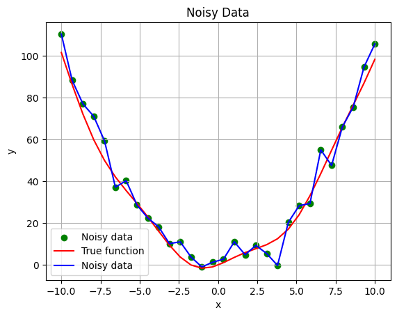
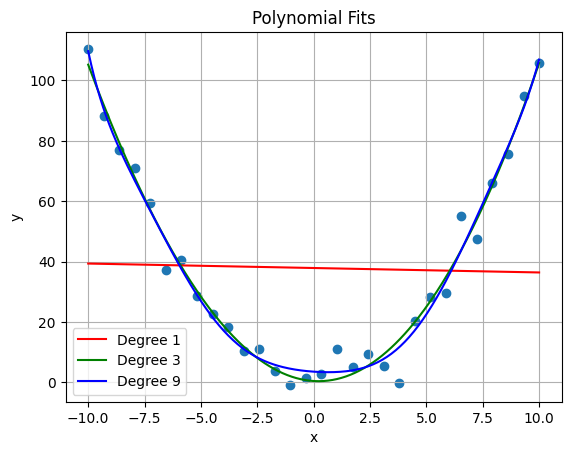

# Python Fundamentals

## Experiment 04: Model Complexity and Overfitting

This experiment studies the effect of model complexity on regression performance.
Polynomial models with different degrees are compared to illustrateunderfitting and overfitting.

## Environment
- Python 3.10.12
- ipykernel
- JupyterLab
- numpy
- matplotlib
- pandas

## Files
- experiment03.ipynb
Jupyter Notebook version, used for interactive experiments and visualization.

## How to run
```bash
Open experiment03.ipynb directly in VS Code and run cells interactively.
```

## Environment Setup (Recommended)
```bash
conda create -n pyfund python=3.10.12
conda activate pyfund
pip install ipykernel jupyterlab numpy matplotlib
```

### Objective Function
f(x) = x^2 + 3 sin(x) + noise ,  x ∈ [-10, 10]

### Method
- changing the model complexity with different degrees.
- illustrate underfitting and overfitting

### Result
- Low-degree models underfit the data.
- High-degree models overfit noisy observations.
- Moderate complexity achieves better generalization.


