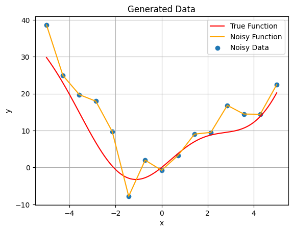
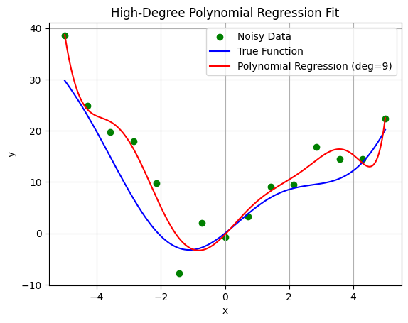
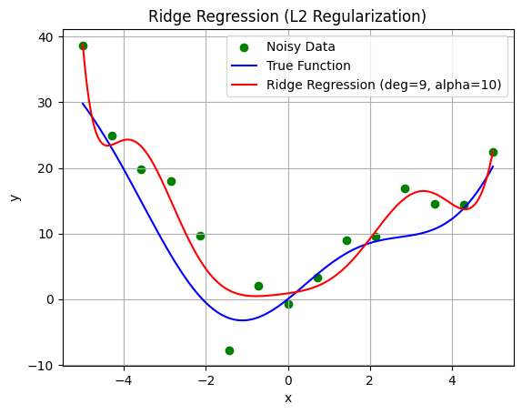
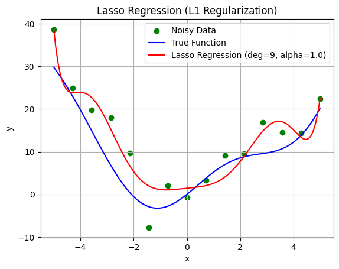

# Python Fundamentals

## Experiment 04: Regularization and Generalization

This experiment studies overfitting and regularization techniques,
including Ridge (L2) and Lasso (L1) regression.

## Environment
- Python 3.10.12
- ipykernel
- JupyterLab
- numpy
- matplotlib
- pandas
- scikit-learn

## Files
- experiment04.ipynb
Jupyter Notebook version, used for interactive experiments and visualization.

## How to run
```bash
Open experiment04.ipynb directly in VS Code and run cells interactively.
```

## Environment Setup (Recommended)
```bash
conda create -n pyfund python=3.10.12
conda activate pyfund
pip install ipykernel jupyterlab numpy matplotlib scikit-learn
```

### Objective Function
f(x) = x^2 + 5 sin(x) + noise ,  x ∈ [-5, 5]

### Methods
- Polynomial Regression
- Ridge Regression
- Lasso Regression

### Result
Regularization effectively reduces overfitting and improves model generalization.

Noisy Data:



普通多项式回归（过拟合）：



Ridge回归（L2正则）



Lasso回归（L1正则）:

