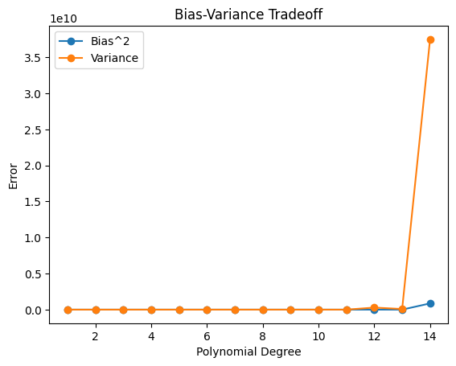
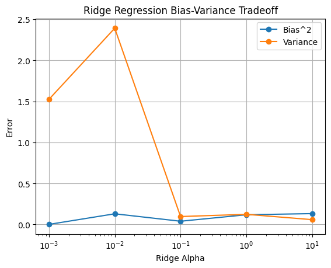
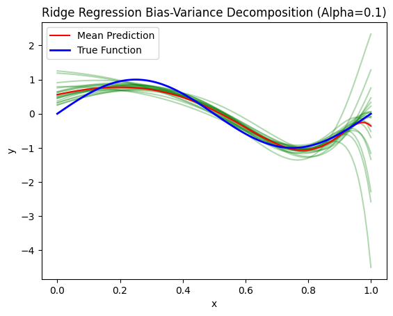

# Python Fundamentals

## Experiment 05: Bias–Variance Tradeoff in Polynomial Regression

In previous experiments, high-degree polynomial regression was observed to exhibit strong fitting ability but unstable behavior under different data samples.This experiment aims to systematically investigate this phenomenon from a statistical perspective.

## Environment
- Python 3.10.12
- ipykernel
- JupyterLab
- numpy
- matplotlib
- pandas
- scikit-learn

## Files
- experiment05.ipynb
Jupyter Notebook version, used for interactive experiments and visualization.

## How to run
```bash
Open experiment05.ipynb directly in VS Code and run cells interactively.
```

## Environment Setup (Recommended)
```bash
conda create -n pyfund python=3.10.12
conda activate pyfund
pip install ipykernel jupyterlab numpy matplotlib scikit-learn
```

### Objective Function
f(x) = sin(2πx) + noise ,  x ∈ [0, 1]

### Experimental Setup
- Training set size: 20
- Test set: fixed dense grid in [0, 1]
- Number of trials: 100
- Noise level: σ = 0.1

### Methods
- Data generating process
- Monte Carlo estimation of bias and variance
- Model families and regularization

### Conclusion
This experiment numerically verifies the bias–variance decomposition and demonstrates the stabilizing effect of regularization.

### Result

偏差-方差分解：



偏差-方差权衡：


Ridge回归中的偏差-方差权衡：



Ridge回归中的偏差-方差分解：

