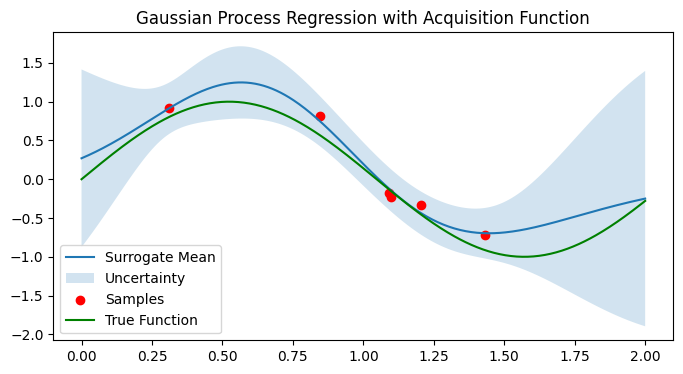

# Python Fundamentals

## Experiment 6: Surrogate-based Data-driven Optimization under Noise

To optimize an unknown noisy objective function using surrogate modeling to reduce evaluation cost.

## Environment
- Python 3.10.12
- ipykernel
- JupyterLab
- numpy
- matplotlib
- pandas
- scikit-learn

## Files
- experiment06.ipynb
Jupyter Notebook version, used for interactive experiments and visualization.

## How to run
```bash
Open experiment05.ipynb directly in VS Code and run cells interactively.
```

## Environment Setup (Recommended)
```bash
conda create -n pyfund python=3.10.12
conda activate pyfund
pip install ipykernel jupyterlab numpy matplotlib scikit-learn
```

### Objective Function
f(x) = sin(3x) + noise ,  x ∈ [0, 2]

### Methods
- Sample initial points from the design space
- Evaluate noisy objective function
- Train surrogate model (Gaussian Process)
- Optimize acquisition function
- Select next evaluation point
- Iterate until budget is exhausted


### Result
- Stable convergence under noise
- Fewer real evaluations

